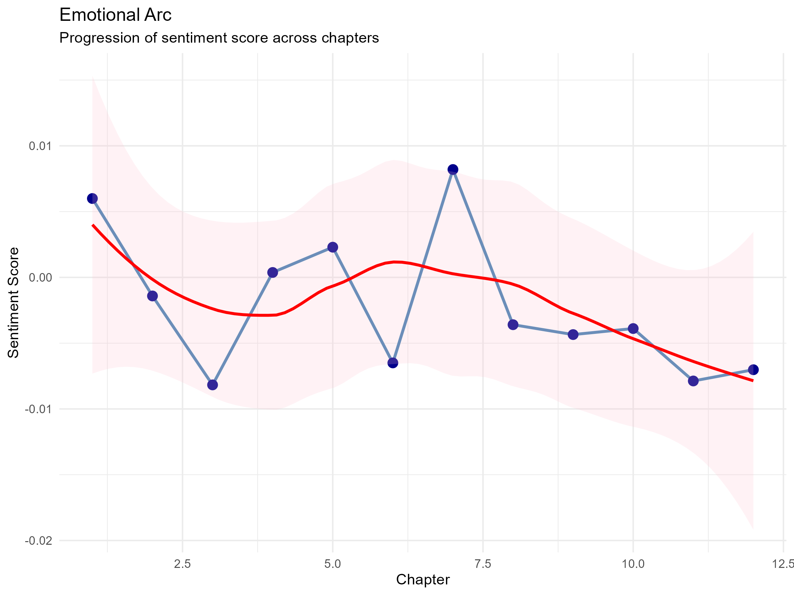
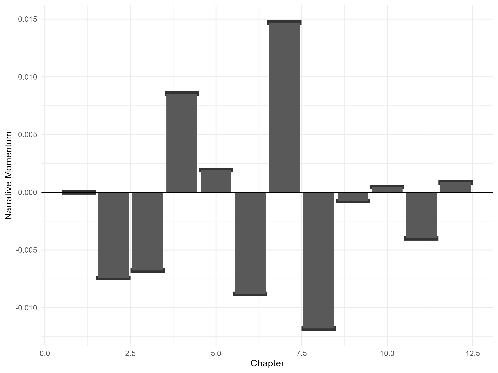
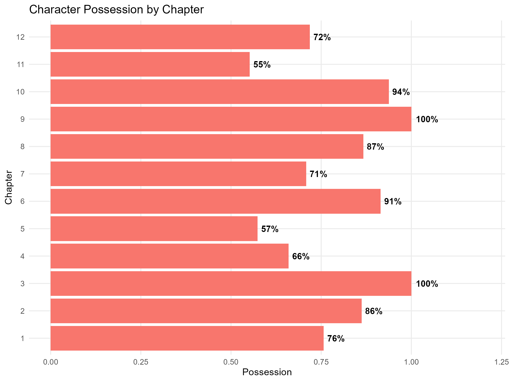

# bookmetrics

`bookmetrics` is an R package designed to analyze public-domain books through the lens of narrative analytics—treating literary works like sports matches. By applying quantitative metrics to text, you can track "momentum," detect key "events," and visualize the animated timeline of a story as it unfolds chapter by chapter.

## Features

### Narrative Match Analytics
- **Gutenberg Ingestion**: Seamlessly download and load books directly from Project Gutenberg using their URLs.
- **Chapter Parsing**: Automatically decompose full texts into structured, sequential chapters.
- **Sentiment Analysis**: Quantify the emotional polarity of each chapter to track narrative shifts.
- **Momentum Analysis**: Calculate the "velocity" of sentiment changes to identify rising action and falling action.
- **Key Event Detection**: Use statistical thresholds to programmatically identify significant shifts in the narrative arc.
- **Match Timeline Visualization**: Generate publication-quality `ggplot2` visualizations representing the book's progression as a timeline.

### Character Analysis
- **Character Possession**: Calculate the relative share of character presence per chapter based on mentions.
- **Influence Tracking**: Visualize how character importance shifts over the course of a story using stacked area charts.

## Installation

You can install the development version of `bookmetrics` from GitHub:

```r
# Install devtools if you haven't already
if (!require("devtools")) install.packages("devtools")

# Install bookmetrics
devtools::install_github("rodri/bookmetrics")
```

## Example Pipelines

### 1. Analyzing Narrative Match Metrics
The following pipeline demonstrates how to transform raw Gutenberg text into an annotated narrative timeline using *Alice's Adventures in Wonderland* (Gutenberg ID 11).

```r
library(bookmetrics)
library(dplyr)
library(ggplot2)

# 1. Ingest the book from Project Gutenberg via its URL
book_data <- load_gutenberg_book("https://www.gutenberg.org/files/11/11-0.txt")

# 2. Parse the text into a structured chapter-level tibble
chapters <- split_into_chapters(book_data)

# 3. Perform sentiment analysis on each chapter
sentiment_data <- compute_sentiment_by_chapter(chapters)

# 4. Calculate match metrics (momentum and intensity)
match_metrics <- compute_match_metrics(sentiment_data)

# 5. Detect significant narrative events based on momentum shifts
events <- identify_key_events(match_metrics)

# 6. Visualize the raw sentiment/momentum timeline
plot_match_timeline(match_metrics)

# 7. Visualize the timeline with detected key events annotated
plot_annotated_match_timeline(match_metrics, events)
```

# 2. Analyzing Character Possession and Influence
This pipeline tracks how different characters dominate the narrative presence throughout each chapter.

```r
library(bookmetrics)
library(dplyr)
library(ggplot2)

# 1. Ingest and parse book
book_data <- load_gutenberg_book("https://www.gutenberg.org/files/11/11-0.txt")
chapters <- split_into_chapters(book_data)

# 2. Extract mentions for a set of characters
chars <- c("Alice", "Rabbit", "Hare", "Caterpillar")
char_mentions <- extract_character_mentions(chapters, chars)

# 3. Compute possession percentage per chapter
possession_data <- compute_character_possession(char_mentions)

# 4. Visualize character presence dominance per chapter
plot_character_possession(possession_data)

# 5. Visualize the temporal shift in character influence
plot_character_influence_timeline(possession_data)
```

## Example Gallery

Once you run the analysis pipeline, `bookmetrics` produces a series of publication-quality visualizations that reveal the narrative's progression:

* **Emotional Arc**: A line plot showing how the sentiment (polarity) shifts from chapter to chapter.



* **Match Timeline**: A bar chart representing the "momentum" and intensity of narrative changes.



* **Annotated Timeline**: An enhanced version of the match timeline that automatically flags significant breakthroughs, collapses, or turning points.
* **Character Possession**: A horizontal bar ... (see full text in file)



* **Character Influence**: A stacked area chart illustrating how character prominence evolves over the entire book.

## Running the Demo Script

You can see the full power of `bookmetrics` by running the provided demonstration script. This script loads *Alice in Wonderland*, performs a complete analysis, and saves all plots to a configurable directory (defaulting to `man/figures`).

```r
# Run the Alice in Wonderland demo
Rscript inst/examples/alice_demo.R
```

After running, check the configured directory (e.g., `man/figures`) for the generated PNG files.

## Future Features

The development of `bookmetrics` is ongoing. Upcoming modules will include:

- **Character Networks**: Graph-based analysis of character interactions and proximity.
- **Possession Charts**: Tracking the movement of significant objects or themes throughout the text.
- **Emotional Arcs**: Advanced modeling of complex emotional trajectories beyond simple polarity.
- **Interactive Dashboards**: Web-based exploration tools for deep-driving into an individual chapter.
- **Shiny Support**: Seamless integration for building custom narrative analytics applications.

## Gallery
